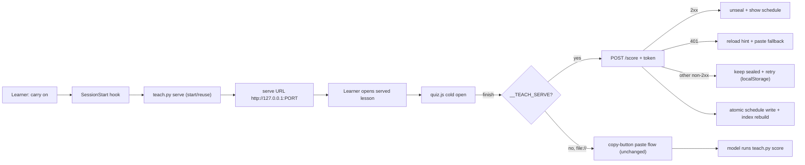

# Design Brief — teach learner-loop UX

### Approach

An optional local course server (`teach.py serve`) serves lessons and a same-origin `POST /score` endpoint, so a served lesson closes its own cold-open loop in the browser without a paste-back into chat; `file://` lessons keep today's copy-button paste flow unchanged as the fallback.

### Why

- Removes the browser→chat context switch and the model-interpretation friction on the happy path (the user's selected pain), while preserving the paste flow as a fallback so nothing regresses.
- Same-origin serve eliminates the `file://`→`http` CORS/preflight gamble, and a per-process token injected into served HTML closes the remote-website forge surface the critics surfaced (cross-origin sites can't read the token, can't guess it).
- `teach.py score` stays the only writer of schedule fields (atomic); `asked`/abandon stay chat-side; the load-bearing invariant's intent (no model-fabricated scores) is preserved because the browser records the taps directly.
- Backward compatible: existing workspaces keep working via paste; the server is opt-in friction-removal, not a hard dependency. The "self-contained/offline/`file://`" constraint is extended, not relaxed.

### Scope

L

### Constraints

- stdlib-only Python 3.11+; no runtime deps. `http.server` only.
- Bind `127.0.0.1` only (loopback) — no Windows firewall prompt, network-off safe.
- Schedule writes atomic (existing `write_text` tmp+`os.replace`); `teach.py score` remains the only schedule writer.
- Paste flow remains the fallback; `file://` lessons unchanged; `check_lesson.py` still validates template structure.
- `asked`/abandon stay chat-side (model runs `teach.py asked` / `teach.py score "abandon"`); the server handles only the happy-path score.
- One server per workspace; ephemeral OS-assigned port; PID/lockfile lifecycle owned by SessionStart/SessionEnd hooks.

### Interface

- `teach.py serve [--workspace <cwd>] [--port 0]` → binds `127.0.0.1`, prints `serve: http://127.0.0.1:PORT`, writes `${CLAUDE_PLUGIN_DATA}/serve.json` = `{pid, port, token, workspace}`.
- `GET /lessons/NNNN-slug.html` → serves the workspace lesson with a per-process token injected just before `</body>`: ``. No `Access-Control-Allow-Origin` header on GET (cross-origin reads blocked).
- `POST /score` body JSON: `{lesson: "lessons/NNNN-x.html", line: "Cold open 0007-x: 1 right, 2 wrong", token: "…"}`.
  - token absent/mismatch → `401`.
  - no open ledger, or lesson doesn't match the open ledger → `409 {error}`.
  - open ledger matches → run `cmd_score`, close ledger, atomic write, rebuild `index.html`; respond `200 {scored: true, schedule: [{id, interval, next, lapses}, …]}`.
  - ledger already closed AND `line` == last scored line for that lesson → `200 {scored: true, already: true, schedule: …}` (idempotent duplicate — not a failure).
  - ledger closed AND different line → `409 {error: "ledger closed, different line"}`.
- `quiz.js` on `finish()`: if `window.__TEACH_SERVE` → `POST /score` with token; on `2xx` unseal + show "Scored. Schedule updated." + render the `schedule` snippet; on `401` show "Session restarted — reload this lesson to reconnect" and reveal the copy button (paste fallback); on other non-2xx keep sealed, show in-page error, persist the line to `localStorage`, retry. If not served (`file://`) → today's copy-button paste flow, unchanged.
- SessionStart hook: for a teach workspace, start `teach.py serve` if not alive (PID/lockfile check — reuse if alive, stale-kill if PID dead, then start); print the serve URL alongside the existing status lines.
- SessionEnd hook: stop the server for the workspace (refcount if multiple sessions share it); stale lockfile cleanup.

### Architecture

### Risks

- (MED) Stale token after a server restart while a long-lived lesson tab stays open → POST `401`. **Mitigation:** `401` → in-page "reload to reconnect" + reveal copy button (paste fallback).
- (MED) `409`-on-retry misread as failure after a successful score. **Mitigation:** duplicate of the last scored line → `200 {already: true}`; `quiz.js` treats every `2xx` (including `already`) as success.
- (MED) Orphaned server process after Claude Code closes. **Mitigation:** SessionEnd hook stops it; next SessionStart stale-PID-kills any orphan holding the lockfile.
- (LOW) Local-process forgery of score lines (token in cleartext served HTML). **Mitigation:** not a regression — workspace files are plain markdown, always locally editable; the invariant defends against model-fabricated scores, not local code execution; the browser records taps directly. The token defends the new remote-website surface.
- (LOW) Mis-tap recorded as a recall signal (scorer sees summary, not raw taps). **Mitigation:** not a regression — the paste flow also scored from the summary; the 3s undo window is the mis-tap mitigation, unchanged.
- (LOW) Single-threaded `http.server` + O(n) `index.html` rebuild per POST. **Mitigation:** `ponytail:` ceiling — single-user, low-frequency; batch/incremental rebuild if N lessons grows.
- (LOW) `check_lesson.py` validator may flag the same-origin `/score` fetch or injected token. **Mitigation:** update `check_lesson` to allow a same-origin relative `/score` POST and to ignore the served-only token script (not present in the `file://` template).

### First Step

Spike `teach.py serve`: stdlib `http.server` bound to `127.0.0.1:0`, serving `GET /lessons/NNNN.html` (inject a token) and a `POST /score` that reuses `cmd_score` + `build_index`. Verify (a) a served lesson page POSTs and scores on finish, (b) a `file://` lesson page still uses the copy-button paste flow unchanged, (c) the idempotent `200 {already:true}` vs `409` contract holds on a re-POST. Then wire the SessionStart/SessionEnd lifecycle and update `check_lesson` for the same-origin POST.
